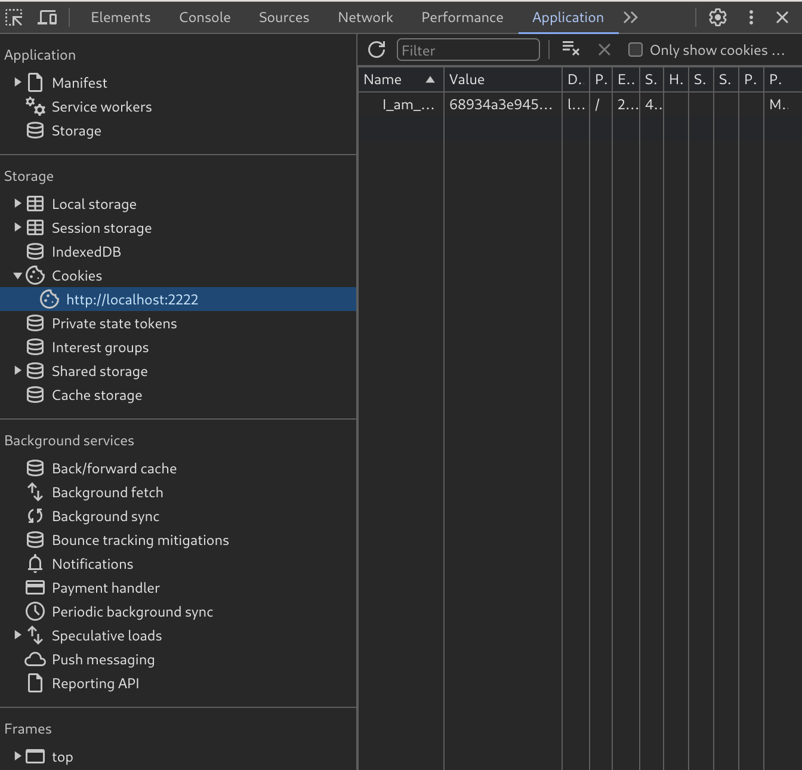

## COOKIE ADMIN TRUE

This one is also easy but not as easy as some others.
Whenever you visit a page, data is stored about you, in order to access that data you need to inspect element and head over to the Applications window. Once there you need click on the cookies dropdown and select whatever is there. 
//TODO explanation about cookies and which kind of cookie are we using. 

 
Once you find the cookie you can see that it contains some values, the one we are fixing on is the "value" one. Inside it there is a random array of numbers and letters, usually when you find this that means that we are looking at some hashed data, so we have to convert it back to something we can actually read. 
To achive this we first have to find which ones are the most used hashes and then use a converter. We first tried with a [MD5 converter](https://md5.gromweb.com/) and got it right, it displayed "false" so we wrote true and hashed it back with an [online hash webapp](https://www.md5hashgenerator.com/)