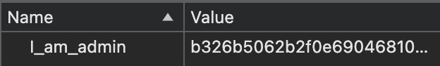
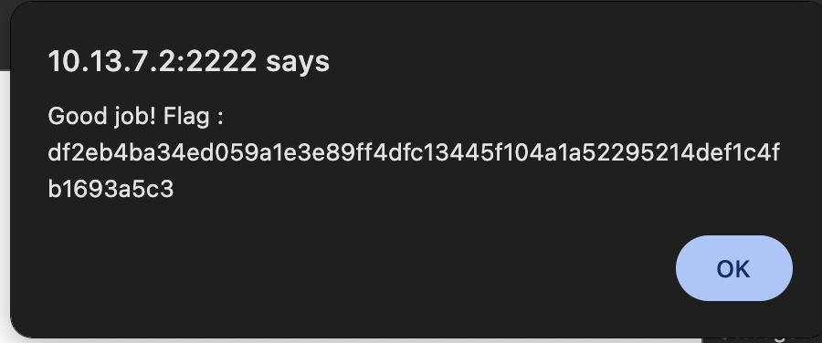

# COOKIE ADMIN TRUE

## What is a cookie??

<code>cookie :</code> cookies are small data packages created by a webserver and stored in the users device. They are usually used in order to store store <i>stateful</i> information about the user.  
The easiest way of seeing this is with a shopping cart. You can go to amazon, without being logged in and add things to your shopping cart. If you were to leave the page and come back later your cart would still be containing the items you added.  

## What about this page's cookies

If you were to inspect this page's cookies you would see that there is only one named <code>I_am_admin</code> and its value is a random string. 
 
When you see a random string like that the first thing that crosses your mind is that it has to be a encrypted string that contains something, so the next step should be decrypting the string. 
The usual suspects tend to be MD5, SHA1, SHA256... 
If we use an [MD5 converter](#https://md5.gromweb.com/) we can see that the value of the cookie is actually the string "false" encrypted. So if we [encrypt the string "true" with MD5](#https://10015.io/tools/md5-encrypt-decrypt) and refresh we should get the cookie. 
 
 
