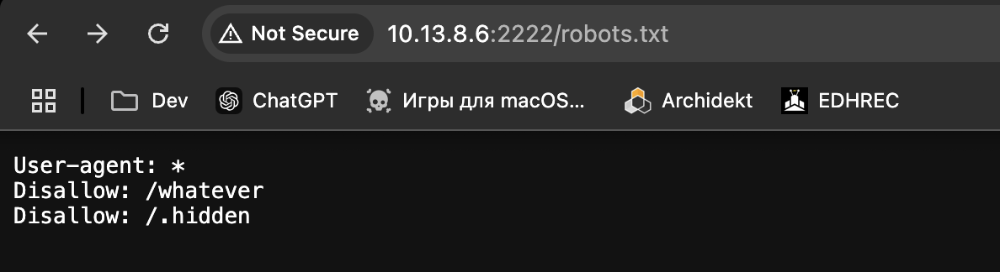
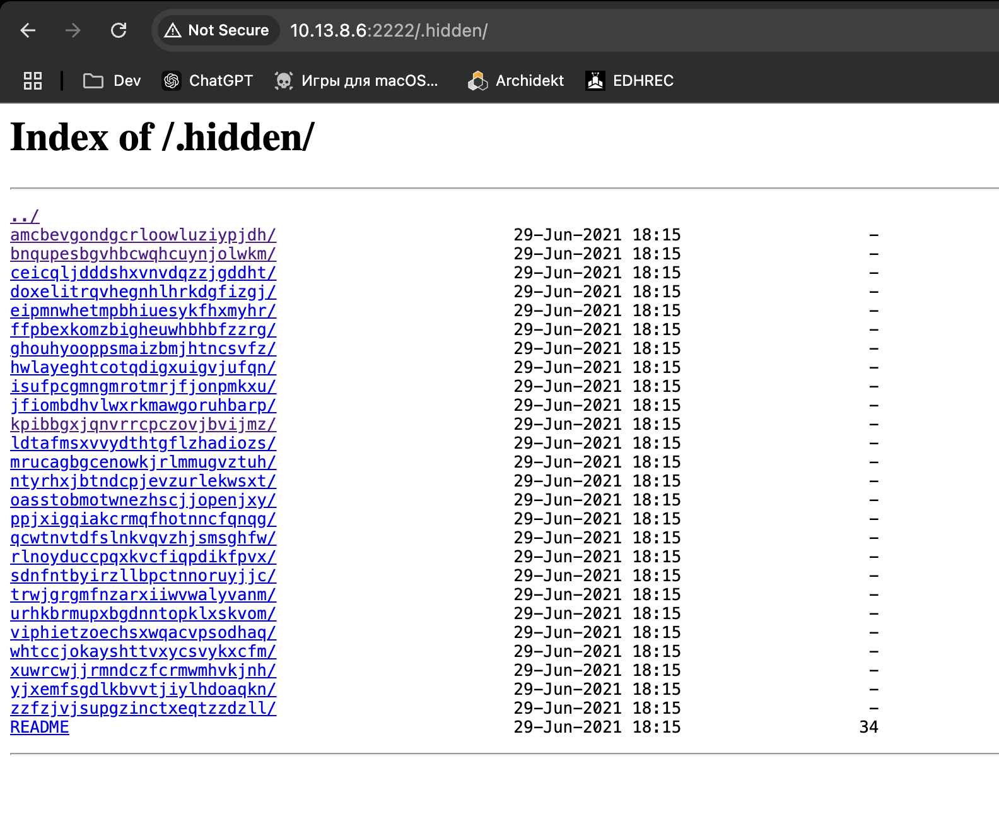
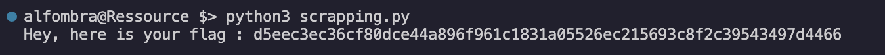

## HIDDEN ROUTES

One of the first things you try when inspecting this project is the robots.txt route.
Upon closer inspection there are 2 routes:
 

If you try to access the .hidden directory you will find this:

If you keep diging you will find that every random named folder contains more random named folder that lead up to a README file. When I found this I thought of making a python script that traverses every folder and tries to see if a README contains the flag.
If you let the script run for a couple of minits you will end up with the flag

