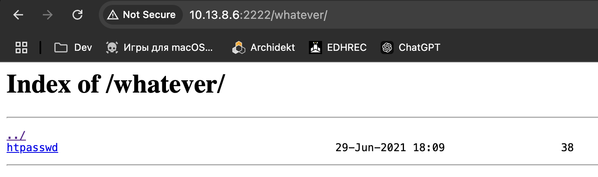
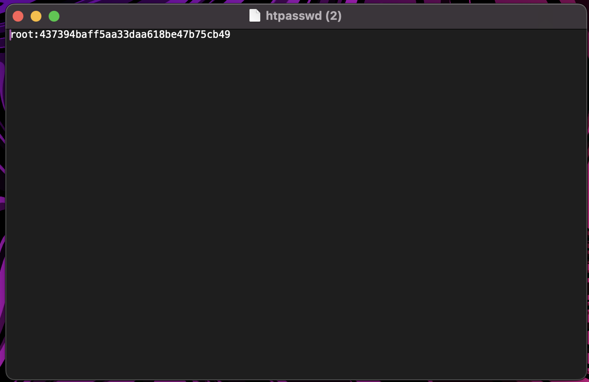
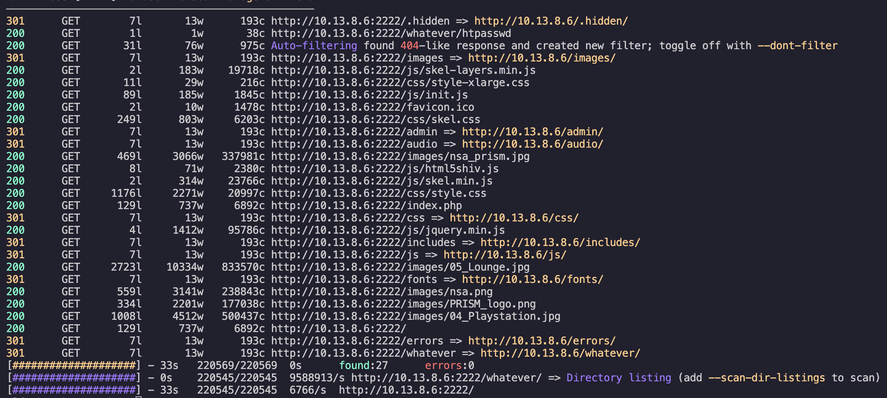
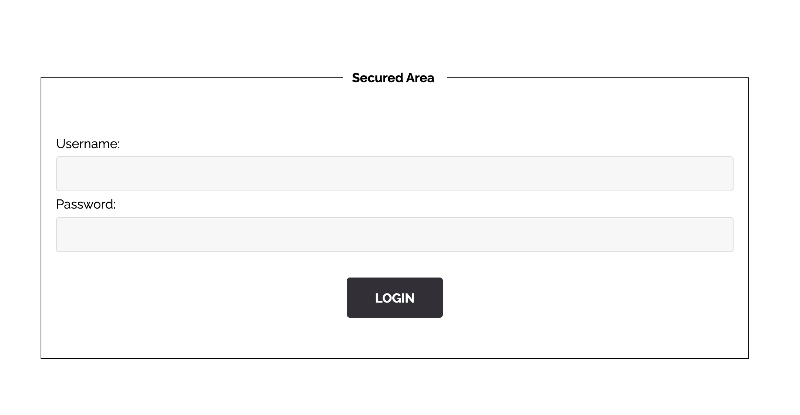

1. feroxbuster -u http://10.13.8.6:2222/whatever -w directory-list-medium.txt
2. curl http://10.13.8.6:2222/whatever/htpasswd
3. root:437394baff5aa33daa618be47b75cb49
4. http://10.13.8.6:2222/admin/
 
437394baff5aa33daa618be47b75cb49 md5 encrypted qwerty123@
https://10015.io/tools/md5-encrypt-decrypt
https://md5.gromweb.com/?string=qwerty123@

d19b4823e0d5600ceed56d5e896ef328d7a2b9e7ac7e80f4fcdb9b10bcb3e7ff

## HTPASSWD

You can apply the same start I used in the <a href="../../hidden_routes/Ressource/README.md">hidden_routes flag</a>. 
 
Once you go to the URL 10.13.8.6:2222/whatever/ you will find that that directory's list contains just the <code>htpasswd</code> file. 
 
That files contents: 
 
It's contents are clearly the root user and it's hashed password. If decrypting it's password you will get the username/password pair. 
I used these 2 tools to decrypt the password [1](#https://10015.io/tools/md5-encrypt-decrypt) & [2](#https://md5.gromweb.com/?string=qwerty123@). The password is <code>qwerty123@</code> encrypted with MD5 
 
Once you have this data you need a place to try to log into. To find the route I used the program feroxbuster, which is a usefull program a colleague showed me. If you input this line: <code>feroxbuster -u http://10.13.8.6:2222/whatever -w directory-list-medium.txt</code> you get this output: 
 
 
Out of those the route admin is the one that draws the most attention, and If you go there you will find this: 
 
So you just input the user and the password and that should get you the flag. 
 

[directory-list-medium.txt](https://github.com/danielmiessler/SecLists/blob/master/Discovery/Web-Content/directory-list-2.3-medium.txt)
Shoutout to [Dave, the only one](https://github.com/Z43L) for showing me so many tools and specially feroxbuster