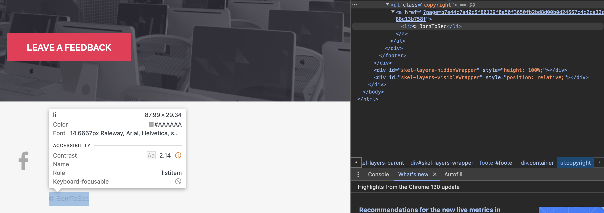
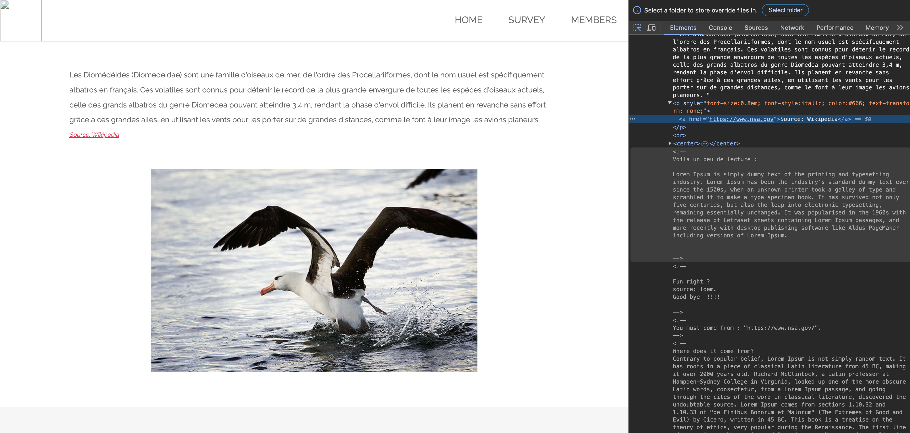
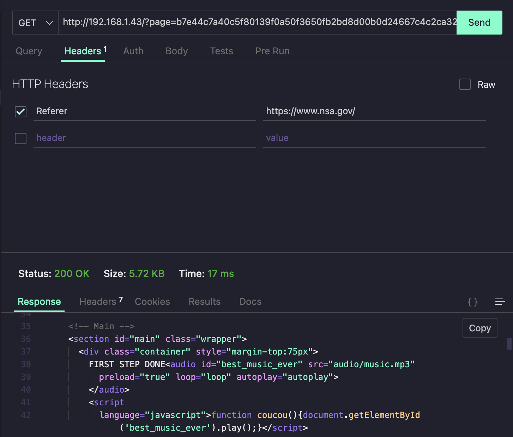
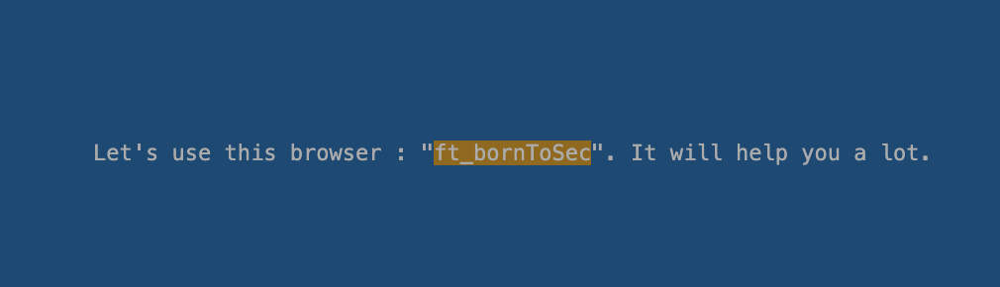
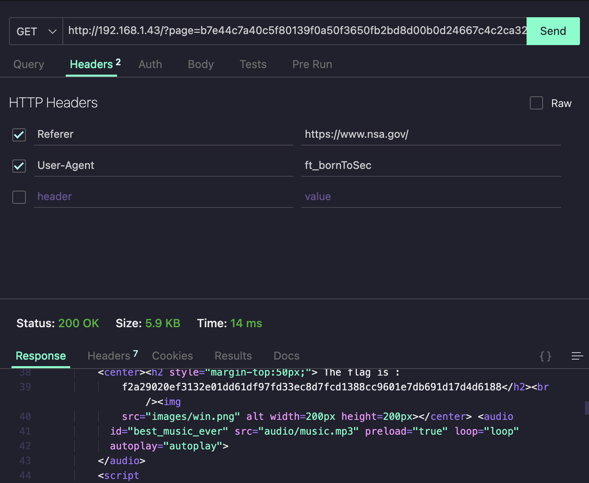

## HTTP HEADER REFERER

Upon inspecting the footer's "© BornToSec" logo you can go to a secret webpage. The url="http://10.13.8.6:2222/index.php?page=b7e44c7a40c5f80139f0a50f3650fb2bd8d00b0d24667c4c2ca32c88e13b758f"
 
 
When you inspect the webpage there is are hidden comments. There is one that says:  "You must come from : https://www.nsa.gov/"
 
When you see this the first thing you think of is that there has to be an http header that tells the server where you come from. [Referer Header](#https://developer.mozilla.org/en-US/docs/Web/HTTP/Headers/Referer) 
This header allows a server to indentify where the user comes from 
If you try sending a request with this header the response will have another clue 
 
If you go to the bottom of the html there is a comment that gives you a clue about the extra header you need
 
The other header we need is User-Agent, to simulate we are using another browser client which might and is needed for the flag. 
The User-Agent is ft_bornToSec, which is the name of this project's name
 
 