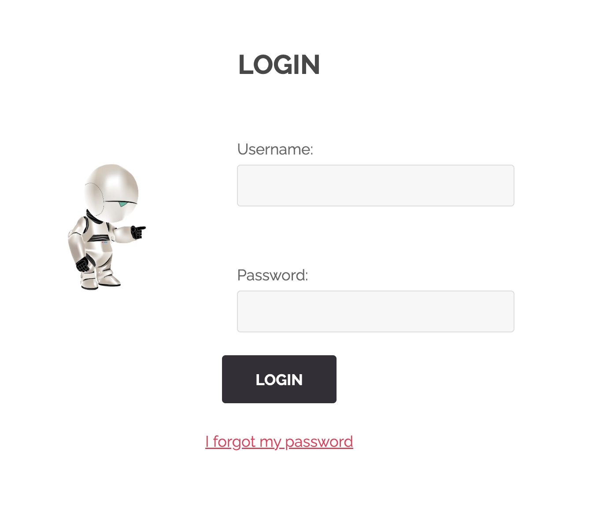
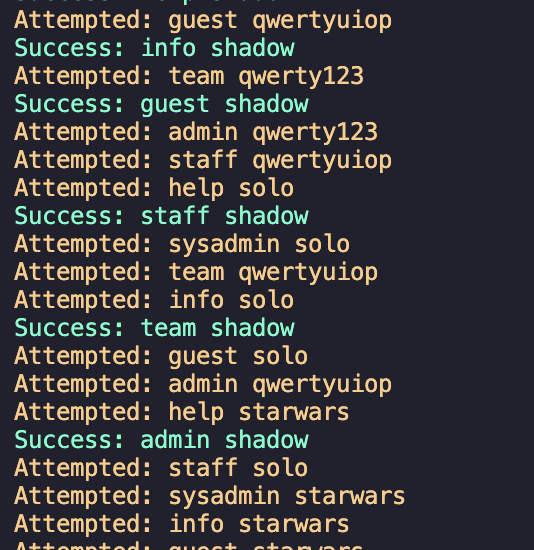
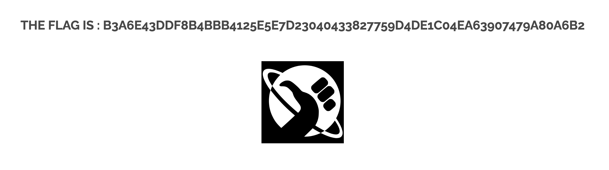

## LOGIN BRUTE FORCE

This website has a login feature. 
  
If you try logging in you will find this little form: 
  
And if you try submitting a random password and username you will get here: 
  
But what we actually care about is this, the URI:
  

# Making a script

By inspecting the last URI you can see that the password and the username are both sent as query parameters. 
So we can make a python script that has both most used usernames and passwords and start making requests until we hit the right pair.  
Once we make the script a run it for some time we will eventually get the right combination/combinations. 
  
So if we try any of those combinations we get the flag. 
  

