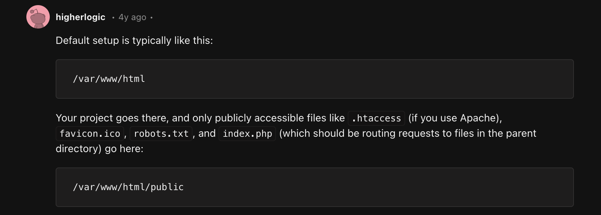
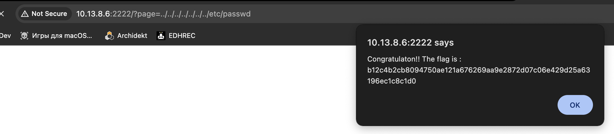

## NO SE COMO LLAMARLA

Si te fijas cuando te mueves por la pagina todas las rutas tienen la forma de 
http://10.13.8.6:2222/?page=loquesea
Y cuando intentas acceder a rutas de esa manera te da una pista con una alerta
Pues sinmas, he mirado donde se suelen guardar los archivos de .php

Asi que me he puesto a jugar con la ruta y a intentar salir de ahi para entrar a /etc/passwd que es [este archivo](https://www.cyberciti.biz/faq/where-are-the-passwords-of-the-users-located-in-linux/) que guarda informacion importante sobre el usuario
Total que claro, tienes que salir de la ruta en la que estes. 
Partiendo de que estamos en /var/www/html/public he probado con http://10.13.8.6:2222/?page=../../../../etc/passwd (me he confundido por 1) pero la alerta ha dicho "almost" asi que he seguido para alante hasta que he dado con el cuando he escrito http://10.13.8.6:2222/?page=../../../../../../../etc/passwd
