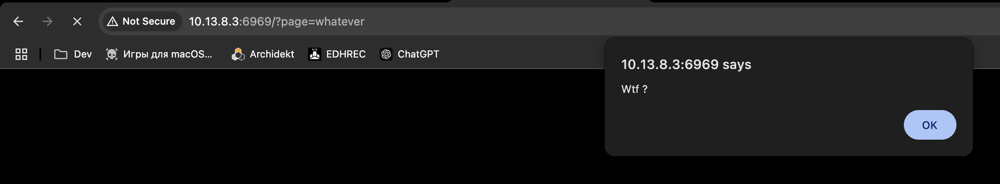
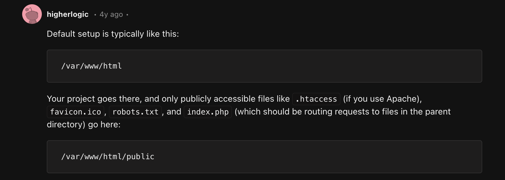
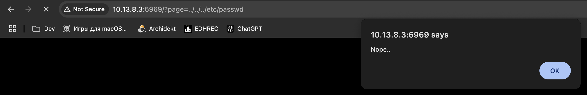
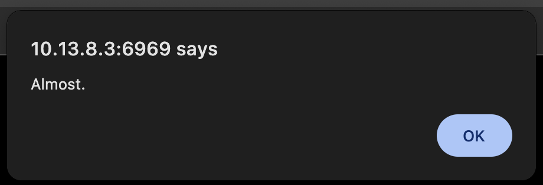
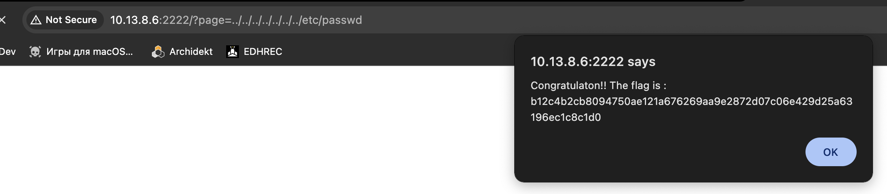

## PATH TRAVERSAL

When you use the query page=whatever (http://10.13.8.6/?page=whatever) you get an alert saying "Wtf ?" 
Once you get this information you can guess that what is going on is that the page being shown in page the file thats in the path written in the "whatever" part 
 
Once you realize this you can start playing with the route. My first tought was to try an look for the passwd file, which is a file in which information about users that have logged in it is stored. 
This file is located at "/etc/passwd". 
And php files are usually located at "/var/www/html/(public)/(whatever)/(...)
 
With this information I started trying to access /etc/passwd with URI's like: 
http://10.13.8.6/?page=../../../etc/passwd 
with that exact prompt you get a different alert message, which is a clue that we are heading in the right direction. 
 
As you keep digging further down you start getting different alert messages 
 
That keeps happening until you reach:  http://10.13.8.6:2222/?page=../../../../../../../etc/passwd and you finally get the flag :) 
 

