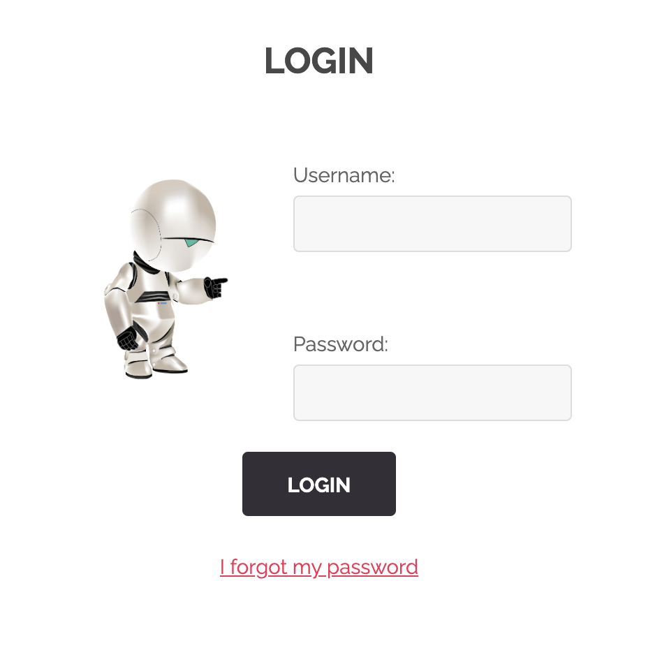
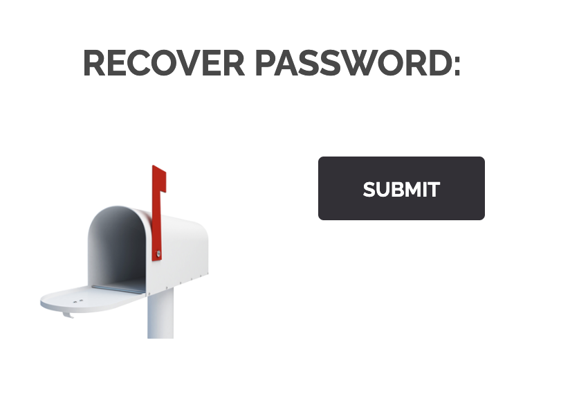
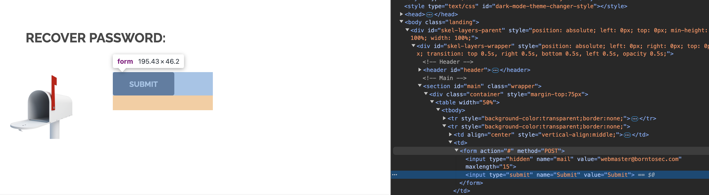

## RECOVER PASSWORD FORM INPUT

The first time you open this webpage the first thing you come upon is the signin page.
 

 
Once you click on signin you can signin, since we dont have an account we are gonna try the recovering password option.
 

 
There you are gonna find a submit button and nothing else.

 
If you inspect the submit button you will find that it is actually a form that is submitting a fixed value. If you change that value you can try to recover other passwords.
 
