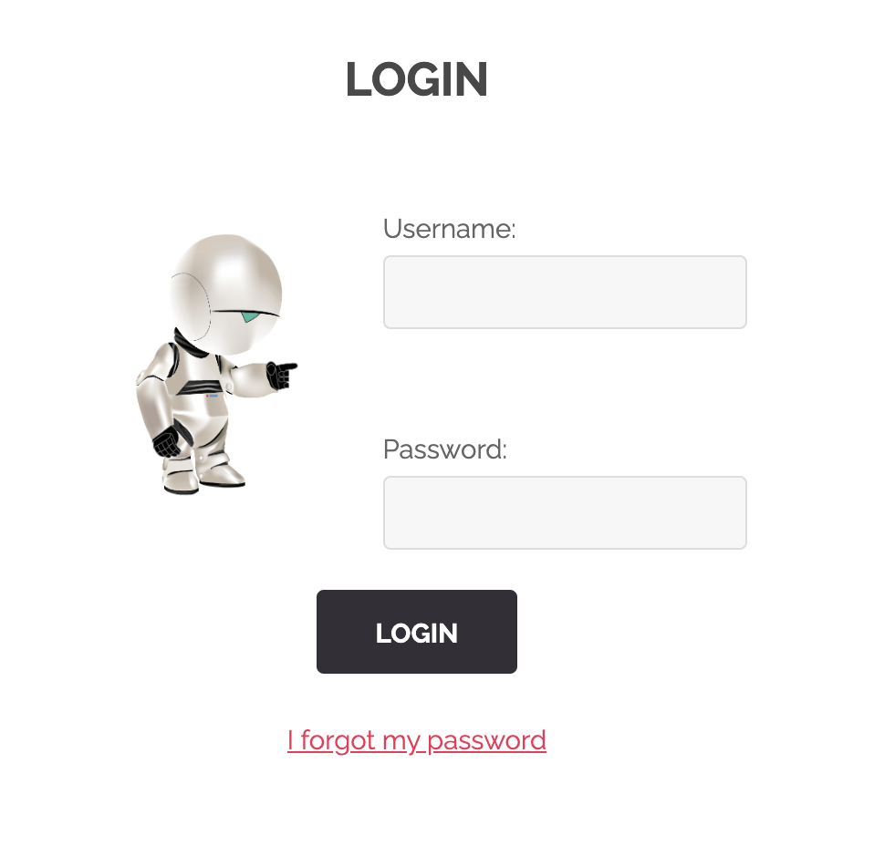

## RECOVER PASSWORD FORM INPUT

This vulnerability is a really dumb one. It revolves around hard-coded html for a recovery password form, which is something I dont think has ever happened or if it has you could probably count how many times with your fingers.  

## Where
This happens in the Login page of the webpage

<table>
    <tr>
        <td></td>
        <td></td>
    </tr>
</table> 
 
If you click on the <i><code>I forgot my password</i></code> anchor you will go to another page. In this page you will just find a submit button. 
 
 
Based on this code I guess that upon submission the password recovery protocol will use the email found in the code to something that would lead to the password being discovered by someone that shouldn't be able to do so.