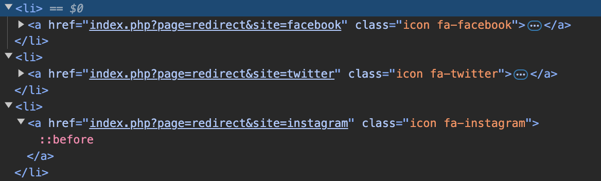
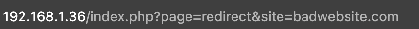
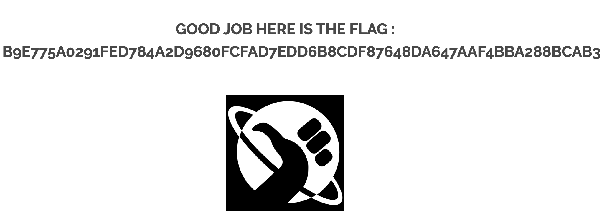

## REDIRECT PAGE

At the bottom of the page there is a footer which multiple social media icons. If you click any of these icons you will get redirected to those social medias. 
  
If you inspect the code you can see how the redirection is made: 
  
Once you see this the vulnerability is really easy to spot. What is going on is that the website allows the query <code>?page=redirect&site=whatever</code> to redirect users to other websites. This can be used to lure other users into malicious websites without them knowing. 
So, if you try redirecting the user to another website like <code>(http://192.168.1.36/index.php?page=redirect&site=badwebsite.com)</code> 
 
You will end up getting the flag. 
 
