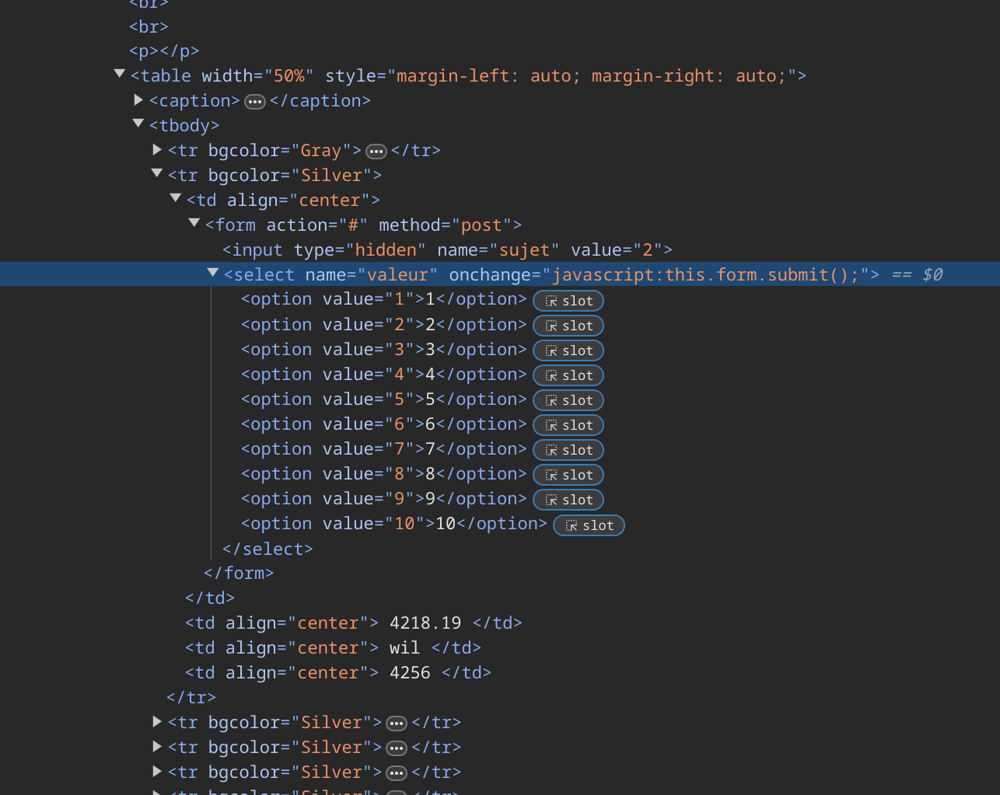

## SURVEY FORM SELECT

On top of this website we have a <code><nav></code> that contains various elements. 
 
If we click the <i>SURVEY</i> text we will end up in another route.  
  

The first time you see that there is clearly something off. This <i>wil</i> dude has 4256, <i>Ben</i> has 666 votes and <i>ol</i> has 69, nice, while the rest do not have scores near those. 
Even weirder, this <i>wil</i> dude has an average of 4218.19 while the rest's average is less than 10, makes since since the biggest grade you can submit is 10 and how the average is calculated.  

# Voting Multiple Times

There is no limit in how many times someone visiting the webpage can vote, so anyone can artificially inflate their score. 
That's how everyone besides <i>Thor</i> and <i>alex</i> has more than 20 votes. 
But there is still one question to ask. What about <i>wil</i>?  

# Submitting a bigger score

<i>wil</i>'s score shouldn't be obtainable, but he clearly has it, so how can this be. If we were to inspect element we could easily how he achieved this: 
  
The value submitted can be changed in the <code>html</code> code so values bigger than 10 can be uploaded and the server's endpoint doesn't seem to care about the score being sent so that's how you can have an average bigger than 10. 
