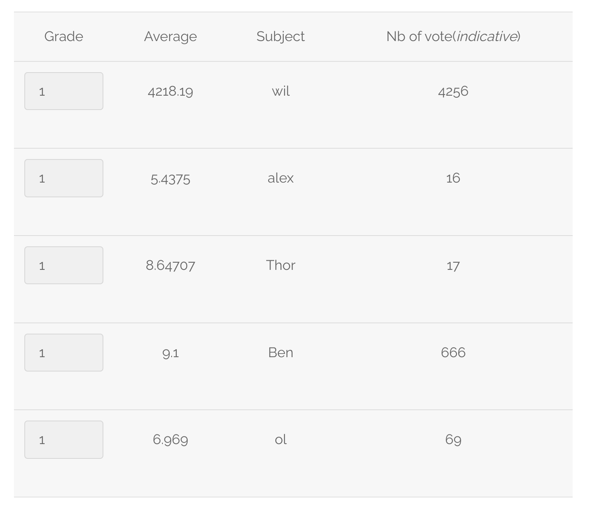
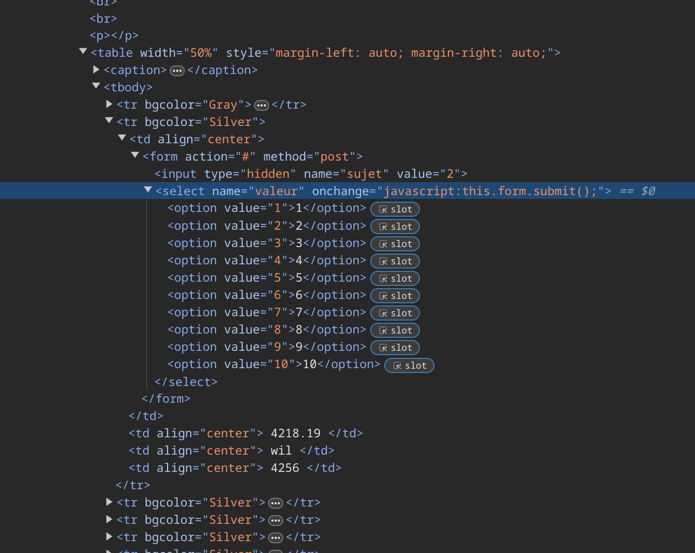

## SURVEY FORM SELECT

This one was the first one we got. The first time you take a look at the survey scores you realize that there is something going on.
 

 
By looking at the scores you can see that Will has 100% cheated and that Ben has voted multiple times, not so sure about Ol.
 
Anyways, by inspecting the HTML code you can see the way you vote is sent.
 

 
By changing the 'value' attribute of the option tag you can submit a vote of a score that's not supossed to be submitted.
 

## TODO (TODAVIA NO ME QUEDA CLARO POR DONDE SE ROMPE)
