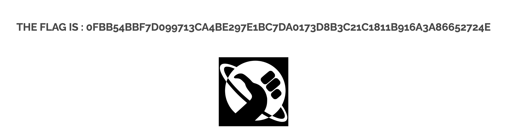

## XSS FEEDBACK

At the bottom of the webpage there is a big button with a text that says "LEAVE A FEEDBACK". 
 
If you click there you will be moved to ["localhost:2222/?page=feedback](#localhost:2222/?page=feedback). 
 
If you type in a <code>name</code> and a <code>message</code> and click on the button <i>"SIGN GUESTBOOK"</i> a commentary will be submitted to the feedback page. 
 
This page contains multiple errors: 
# 1'st: Message Empty Feedback
 
When you submit the form the function validate_form() is called. 
 
This is the function that's called. If you take a closer look you can see that there is a typo. 
The message html input tag has the name attribute set to <code>mtxtMessage</code> and when the value that is checked in the code is <code>mtxMessage</code>. So it does no check if that value is empty and you can upload a feedback with no message. 
 

# 2'st: checkForm???
If you check the html code I showed you before you can see that the <code>btnSign</code> input calls the <code>checkForm()</code> function. 
If you try to find that function you wont find it, and trust me, I've looked for it. But in case you dont I can prove it other way, listen, if just click the <i>"SIGN GUESTBOOK"</i> button and move to the console you will be able to see this: 
 

# 3'rd: XSS

## What is XSS
[XSS](#https://owasp.org/www-community/attacks/xss/) stands for Cross Site Scripting. It consists on injecting malicious code in a website, usually in the form of a browser side script. 
 
This vulnerability is supossed to be about that, not about the other 2 points. What this vulnerability is supossed to be is one in wich you can script, the issue it has is that it's broken. So inputs like: 
<table>
<th>
<code>a</code> 
</th>
<th>
<code>b</code> 
</th>
<th>
<code>script</code> 
</th>
</table> 
give you the flag. But if you try submitting html code and inspect the request and see comment that's left in the page, you'll see that html/php code gets parsed. 
My guess is that the word <i>"script"</i> serves as a <i>"generic script"</i> so you cannot break the page. 
 
 

# 4'rt: Extra

You can also inspect element and change the html so you can submit a bigger comment or a bigger name. If you do you will see this:  
 
You change the <i><code>maxlenght</i></code> attribute on the <i><code>input</code></i> named <i><code>txtName</i></code> and the <i><code>maxlenght</i></code> in the <i><code>textarea</i></code> named <i><code>mtxtMessage</i></code>
 

