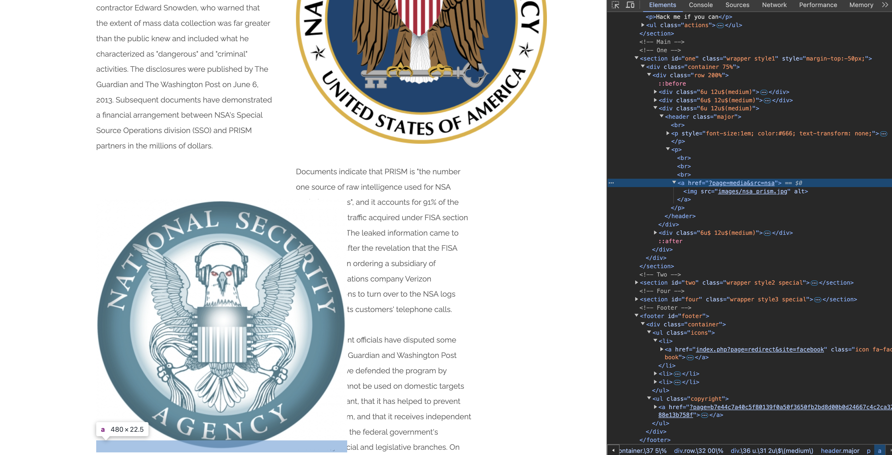
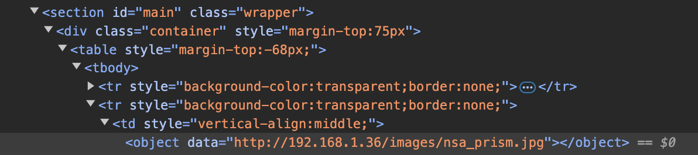
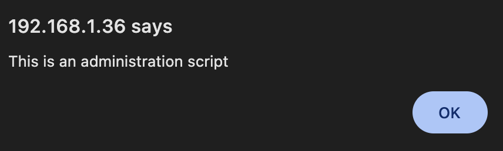
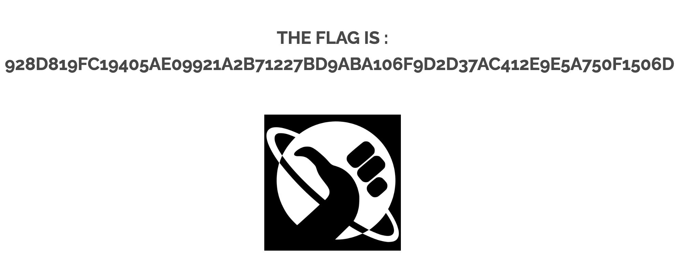

## XSS SRC QUERY

Whenever you inspect the image of the nsa you can see that it has an anchor (\<a>) tag 
  
If we click on the anchor we get sent to the ?page=media page and we can see that the image is searched via Query. 
  
Having the image being searched via Query is a security risk, if it isn't well sanitized malicious code could be sent there. 
If we inspect element we can see that the image being loaded is loaded into a object html tag. 
  
This is helpful, we can see where the <i>src</i> is being loaded, so we can prepare code for that. 
To test this we could try sending some <code>js</code> code. The code has to be sent in the src parameter. We are gonna send this: 
<code>"data:text/html;base64,PHNjcmlwdD5hbGVydCgnVGhpcyBpcyBhbiBhZG1pbmlzdHJhdGlvbiBzY3JpcHQnKTwvc2NyaXB0Pg=="</code> 
Which is: 
<code>\</code> 
If we try to load that code in the <code>object</code> html tag we can see that it works. 
  
So if we send that code in the src query part we will get the flag:
  

