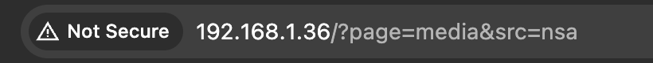

## TODO

Whenever you inspect the image of the nsa you can see that it has an anchor (\<a>) tag 
 
Once we are in the route you can see that the image is searched via Query. This means that the search is part of the URI and if its not sanitized we could send some code. 
 
If we wanna inject JavaScript code in the URI we need to send it in the src part of the request. You send this string: "data:text/html;base64,PHNjcmlwdD5hbGVydCgnVGhpcyBpcyBhbiBhZG1pbmlzdHJhdGlvbiBzY3JpcHQnKTwvc2NyaXB0Pg==" 
The data part tells the browser thats the data part of the URI 
The part of text/html tells the server that the data that's gonna be sent is html 
The next part tells that the enconding is gonna be encoded in base64 and the last part is the code enconded in base64. 
This code executes code in the back end. Exactly ""
 
